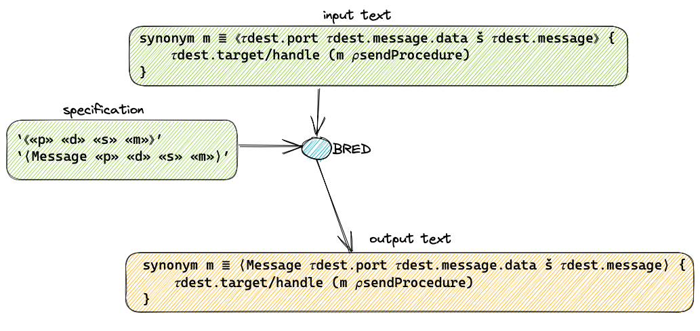

# BRED - Text manipulation based on matching brackets

BRED is a tool that helps in re-formatting text.

BRED captures bits of text and allows users to fabricate new text based on the captured text.

See doc/documentation.md for further details.